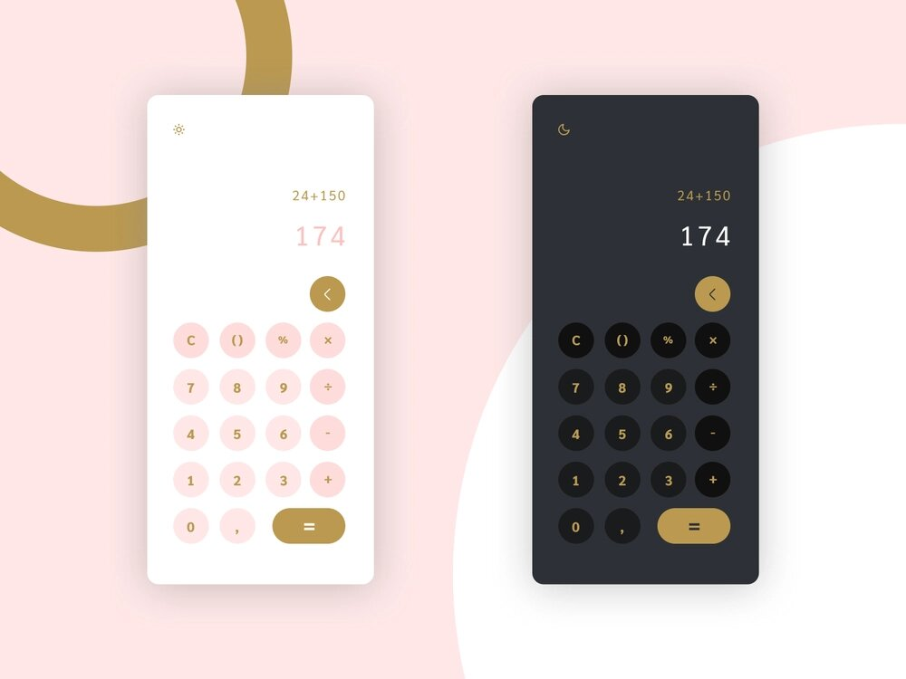

# The Pascaline 🎬
Basic mobile friendly design calculator.

[Checkout the demo](https://plyr.io)

# Features

- 📱 **Dark mode**
- 🧮 **Basics operations** - add, substract, divide, multiply, modulo
- 🖌️ **Mobile design** - build with mobile UI

# Author

Bunny is developed by [@Naveen](https://github.com/claymeers)